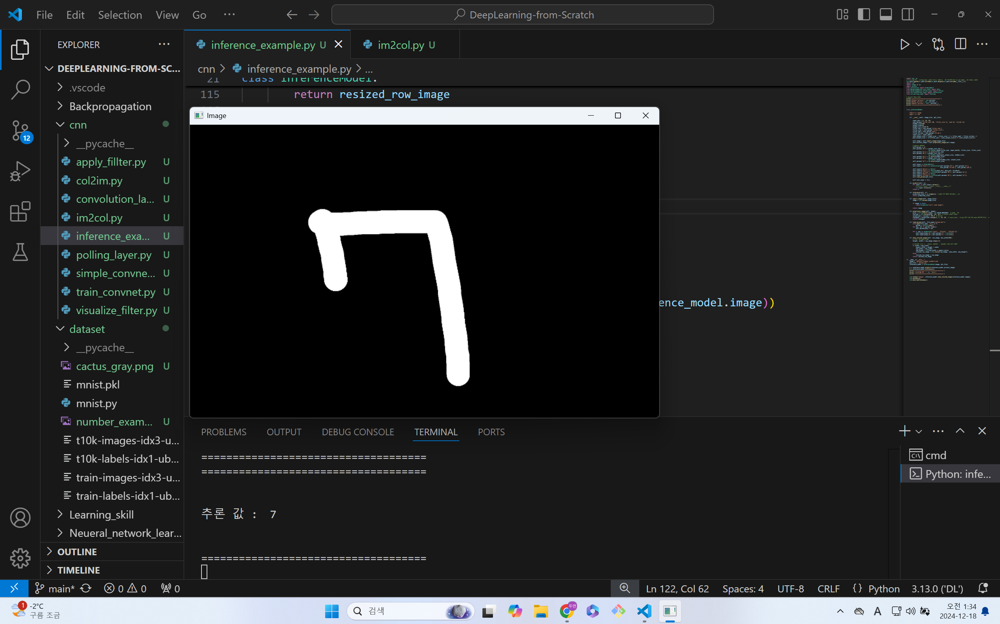

# DeepLearning-from-Scratch

## 공부 정리 주소

### https://dy0221.tistory.com/15

## 밑바닥부터 시작하는 딥러닝 github 주소

### https://github.com/WegraLee/deep-learning-from-scratch/tree/master

## 손글씨 이미지 추론



## conda 가상환경으로 code runner를 실행하는 방법

왼쪽 위에 File에 Save Workspace As를 눌러서 .code-workspace파일을 만든다.

그 후 setting을 고친다. [Stackoverflow juso](https://stackoverflow.com/questions/72556952/code-runner-in-vs-code-not-running-conda-python)

```json
{
    "folders": [
        {
            "path": "."
        }
    ],
    "settings": {
        "code-runner.executorMap": {
            "python": "C:\\Users\\wjm25\\anaconda3\\envs\\DL\\python.exe"
        },
        "python.defaultInterpreterPath": "C:\\Users\\wjm25\\anaconda3\\envs\\DL\\python.exe"
    }
}
```
