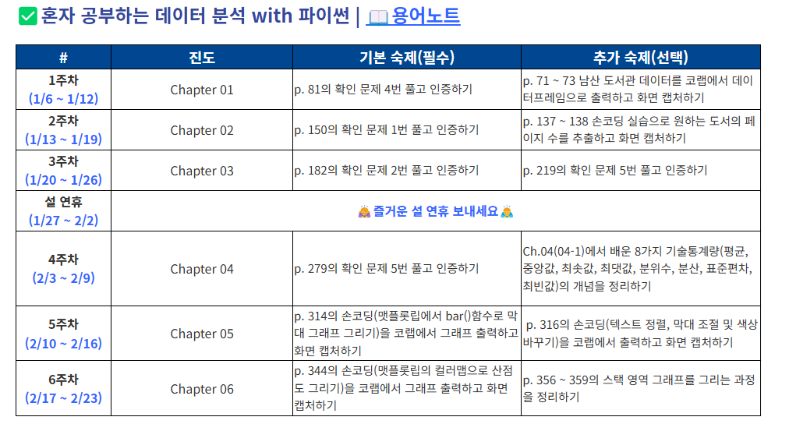

# 혼공 데이터 분석 with 파이썬
> **혼자 공부하는 데이터 분석 with 파이썬** 책의 GitHub 저장소  
> [GitHub 주소](https://github.com/rickiepark/hg-da)

## **공부한거 정리**
[tistory 주소](https://dy0221.tistory.com/26)

---

## 프로젝트 기간


---
## 프로젝트 버전
- window 11
- Python: 3.13.1
- Numpy: 2.2.1
- Matplotlib: 3.10.0
- Pandas: 2.2.3
---

## Conda 가상환경으로 Code Runner 실행하기

Conda 가상환경에서 VS Code의 Code Runner를 실행하려면 다음 단계를 따라하세요([Stackoverflow juso](https://stackoverflow.com/questions/72556952/code-runner-in-vs-code-not-running-conda-python)):

### 1. `.code-workspace` 파일 생성
1. VS Code 상단 메뉴에서 **File > Save Workspace As**를 선택하여 `.code-workspace` 파일을 만듭니다.

### 2. `settings` 수정
생성한 `.code-workspace` 파일에 아래 내용을 추가하거나 수정합니다. 

```json
{
    "folders": [
        {
            "path": "."
        }
    ],
    "settings": {
        "code-runner.executorMap": {
            "python": "C:\\Users\\wjm25\\anaconda3\\envs\\hongong\\python.exe"
        },
        "python.defaultInterpreterPath": "C:\\Users\\wjm25\\anaconda3\\envs\\hongoong\\python.exe"
    }
}
